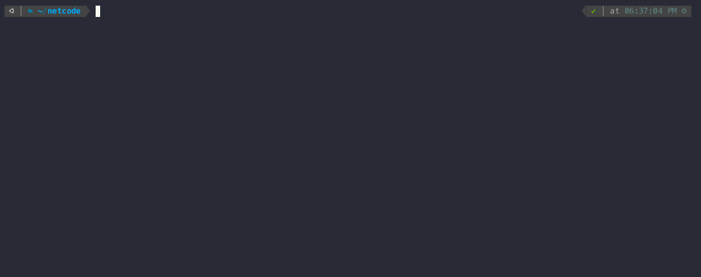

<div align="center">
  <h1>
    <a href="https://github.com/networkprotocol/netcode"><code>netcode</code></a> rust implementation
    <br>
    <a href="https://github.com/benny-n/netcode/actions/workflows/ci.yml">
      
    </a>
    <a href="https://github.com/benny-n/netcode/blob/main/LICENSE">
      
    </a>
    <a href="https://crates.io/crates/netcode-rs">
      
    </a>
  </h1>

</div>



## Protocol

This crate implements the [netcode](https://github.com/networkprotocol/netcode)
network protocol created by [Glenn Fiedler](https://gafferongames.com).

> `netcode` is a simple connection based client/server protocol built on top of UDP.

See the official upstream [specification](https://github.com/networkprotocol/netcode/blob/v1.2.1/STANDARD.md) to learn more about how the protocol works.

## Install

Run the following Cargo command in your project directory:

```bash
cargo add netcode-rs
```

Or add the following line to your Cargo.toml:

```toml
[dependencies]
netcode-rs = "1.3.0"
```

**NOTE:** While the crate name is `netcode-rs`, the library name is actually `netcode`. <br>
This means that even though you used `cargo add netcode-rs` to add the dependency, you will need to write `use netcode::*` (and _not_ `use netcode_rs::*`) to use it. <br>

I know this is confusing, and I know that [`-rs` crate names are frowned upon](https://rust-lang.github.io/api-guidelines/naming.html#:~:text=Crate%20names%20should%20not%20use,remind%20users%20of%20this%20constantly.). <br>
Unfortunately the original `netcode` crate is unmaintained and its maintainer is unreachable, so I could not get the ownership for the crate name.
I didn't want to use names like `netcode2` to avoid confusion with the netcode protocol versions.

## Examples

### server

```rust
use std::{thread, time::{Instant, Duration}};
use netcode::{Server, MAX_PACKET_SIZE};

// Create a server
let protocol_id = 0x11223344u64; // a unique number that must match the client's protocol id
let private_key = netcode::generate_key(); // you can also provide your own key
let mut server = Server::new("0.0.0.0:5555", protocol_id, private_key).unwrap();

// Run the server at 60Hz
let start = Instant::now();
let tick_rate = Duration::from_secs_f64(1.0 / 60.0);
loop {
    let elapsed = start.elapsed().as_secs_f64();
    server.update(elapsed);
    while let Some((packet, from)) = server.recv() {
       // ...
    }
    thread::sleep(tick_rate);
}
```

### client

```rust
use std::{thread, time::{Instant, Duration}};
use netcode::{ConnectToken, Client, MAX_PACKET_SIZE};

// Generate a connection token for the client
let protocol_id = 0x11223344u64; // a unique number that must match the server's protocol id
let private_key = netcode::generate_key(); // you can also provide your own key
let client_id = 123u64; // globally unique identifier for an authenticated client
let server_address = "my-domain.com:5555"; // the server's public address (can also be multiple addresses)
let connect_token = ConnectToken::build(server_address, protocol_id, client_id, private_key).generate().unwrap();

// Start the client
let token_bytes = connect_token.try_into_bytes().unwrap();
let mut client = Client::new(&token_bytes).unwrap();
client.connect();

// Run the client at 60Hz
let start = Instant::now();
let tick_rate = Duration::from_secs_f64(1.0 / 60.0);
loop {
    let elapsed = start.elapsed().as_secs_f64();
    client.update(elapsed);
    if let Some(packet) = client.recv() {
        // ...
    }
    thread::sleep(tick_rate);
}
```

See [examples](https://github.com/benny-n/netcode/tree/main/examples) for more.

## Planned Features

- [ ] [`reliable`](https://github.com/networkprotocol/reliable) packet acknowledgement system
- [ ] [`bevy`](https://github.com/bevyengine/bevy) plugin
